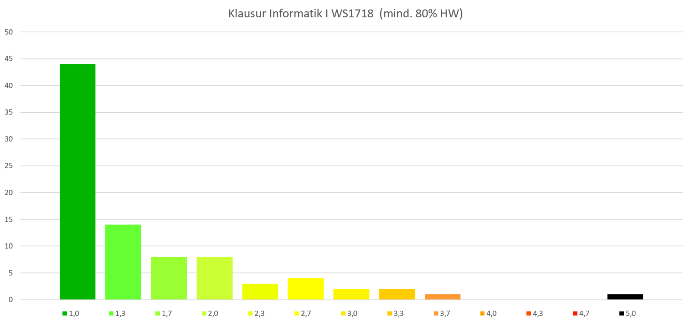

<style>
img[alt~="center"] {
  display: block;
  margin: 0 auto;
}
</style>

# Tutorial 01 - 09.11.2020

Group 02 - Moritz Makowski

<br/>

## Introduction

---

## Today's Agenda

-   What is "Computer Science" and "Programming"?
-   Installing `gcc`
-   Navigating inside a Terminal with `pwd`, `cd` and `ls`
-   Writing our first program `hello_world.c`
-   Using `gcc` for our first program
-   Why should we use an IDE?
-   Showcase: CLion
-   Homework for IN8011

---

## What is Computer Science?

> Informatics is the study of the storage, transformation, and
> communication of information.

Source: [Department of Informatics @ TUM](https://www.in.tum.de/en/for-prospective-students/bachelors-programs/informatics/)

---

## What is Programming?

> Computer programming is the process of designing and building
> an executable computer program for accomplishing a specific
> computing task.

Source: [Computer programming @ Wikipedia](https://en.wikipedia.org/wiki/Computer_programming)

<br/>

---

**Summary:** _Computer Science_ is the study of what computers (can) do - _Programming_ is the practice of making computers do things.

We will cover a little bit of both topics during this semester.

---

## Let's just cut to the chase ... What do we do here?

Programmers write computer programs in a **programming language** of their choice. Each language has its own benefits and trade offs.

We will use a programming language called **C**.

<br/>

Example script `hello_world.c`:

```c
#include <stdio.h>

int main() {
    printf("Hello, World!\n");
    return 0;
}
```

---

## And what can we do with it?

Computers cannot read these scripts directly. You have to **translate** it first so that a computer can understand it. This translating is called **compiling**.

**C Script** ⤳ compiles to ⤳ **Executable Program**

<br/>

Compilation progress:

```bash
$ gcc hello_world.c -o program
$ ./program
Our number is: ?.
```

---

## Install gcc on Windows - #1 _(by Philipp Kaeß)_

First, let’s check if **gcc** is already installed on your computer.

1. Open the Terminal (Mac)/ Command Prompt (Windows)

2. type `gcc` and press `enter`

If it says **`gcc: fatal error: no input files`** **gcc** is already installed, and you can lean back.

If it doesn’t recognize the command, you have to install it by executing the following instructions.

---

## Install gcc on Windows - #2 _(by Philipp Kaeß)_

1. Go to google, type **"MinGW getting started"** ([click here](https://www.google.com/search?q=MinGW+getting+started)), open first result

2. Click on **"mingw-get-setup.exe"** ([click here](http://www.mingw.org/wiki/getting_started))

3. Open downloaded file

4. Choose **"C:\MinGW"** as path

5. Download the installation manager and open it

---

## Install gcc on Windows - #3 _(by Philipp Kaeß)_


6. Mark **`mingw32-developer-tool`**, **`mingw32-base`**, **`mingw32-gcc-g++`** and **`msys-base`** for installation

7. Click on **installation (top left) -> apply changes -> apply**

---

## Install gcc on Windows - #4 _(by Philipp Kaeß)_

You just installed gcc. But to be able to simply use it in the terminal, you first have to tell your system where to find the new program.

1. Close the Installation-Manager, open the explorer and go to the folder you just created (if you followed this instruction it is **"C:\MinGW"**)

2. Open **"bin"**

3. Click onto the bar with the path in it and copy the path, close explorer

---

## Install gcc on Windows - #5 _(by Philipp Kaeß)_

4. Type **"Erweiterte Systemeinstellungen"**/**"Advanced System Settings"** into the search bar and open it

5. Click on **"Systemumgebungsvariablen bearbeiten"** and then on the button
   **"Umgebungsvariablen"**

6. Search for the Variable **"Path"** (IMPORTANT! Path not PATH!) in the lower part of the window (System-Variables not User Variables)

7. Double-click **"Path"** and click on **"Neu"**

8. Paste the path you just copied and click on **"OK"** to close all the windows you just opened

---

## Install gcc on Windows - #6 _(by Philipp Kaeß)_

You did it! You can now test if your compiler works. Therefore type **"cmd"** into your searchbar and open it.

_(**IMPORTANT:** If the terminal is still open from the last time you used it, close and reopen it, otherwise the changes we just did won’t be recognized.)_

Type **"gcc"** and press `enter`.

If it now says **`gcc: fatal error: no input files`** you are finished and have successfully installed gcc!

---

## Install gcc on Mac - #1

It is really easy to install gcc on Mac!

1. Open the program called **terminal**

2. Type in **"gcc"** and hit `enter`

If it says **`clang: error: no input files`** then gcc is install correctly.

3. If you haven't installed gcc already a window pops up saying something like **"Install command line tools now?"**

4. Hit confirm and wait for the installation to finish (Can take a few minutes)

---

## Install gcc on Mac - #2

**Alternative installation** via [Hombrew](https://brew.sh/index_de):

1. Install Homebrew: https://brew.sh/

2. Run **"brew install gcc"** (Can take a few minutes)

---

## Text based navigation through your file system - #1

The type of navigation you already know:


---

## Text based navigation through your file system - #2

In the **console**/**terminal** we use three commands to navigate **without a GUI** (Graphical User Interface).

1. **`pwd`** ("print working directory") prints out the path of the directory we are currently in. In windows you can use **`echo %cd%`**.

2. **`cd <directory_name>`** ("change directory") switches to another directory. `cd ..` goes to the parent directory of the current directory.

3. **`ls`** ("list directory") prints out all files inside the current directory. `ls -a` also prints hidden files (filename begins with `.`). In windows you can use **`dir`**.

---

## Text based navigation through your file system - #3

**`pwd`**, **`cd`** and **`ls`** in action:

```bash
$ pwd
/Users/moritzmakowski/ComputerScience/C

$ ls
Big Projects				Exercises
Cheatsheet Variables.pages		Small Projects
Engineering-Informatics-1-MSE-WS1920

$ cd Engineering-Informatics-1-MSE-WS1920

$ ls
CMakeLists.txt		tutorial-01		tutorial-04
README.md		tutorial-02		tutorial-05
cmake-build-debug	tutorial-03		tutorial-06

$ pwd
/Users/moritzmakowski/ComputerScience/C/Engineering-Informatics-1-MSE-WS1920
```

---

## Our first C-Program - #1

We are inside the directory `tutorial-01`.

<br/>

Inside the file `hello_math.c` we write:

```c
#include <stdio.h>

int main() {
    int a = 2;
    int b = 7;
    int c = a + b;
    printf("Our number is: %d.\n", c);
    return 0;
}
```

_You can use TextEdit (Mac) or Notepad (Window) to do that._

---

## Our first C-Program - #2

Now we can compile it:

```bash
$ ls
hello_world.c

$ gcc hello_world.c -o program

$ ls
hello_world.c   program
```

<br/>

We can execute the program with:

```bash
$ ./program
Our number is: 9.
```

---

## Will we code with TextEdit/Notepad forever?

No! There are special programs which are exclusively made for writing code:

-   Editors

-   IDE's (Integrated Development Environments)

---

**Editors** are made to write code. The program highlights the text in different colors so you can read the code more easily. This is called **syntax highlighting**.

Example:

```c
#include <stdio.h>

int main() {
    int a = 2;
    int b = 7;
    int c = a + b;
    printf("Our number is: %d.\n", c);
    return 0;
}
```

---

**IDE's (Integrated Development Environments)** are not only doing syntax highlighting but a lot more, such as:

-   Code analysis: The program can find errors in your code and show specific error messages - sometimes even with a proposed solution

-   Refactoring: Restructure your code, e.g. change variable names, file names, etc.

-   Generate files from blueprints - e.g. a `hello_world.c` file when you create a new project

-   ...

---


## My Recommendation: [CLion](https://www.jetbrains.com/clion/) by [JetBrains](https://www.jetbrains.com/)

-   Great Code Analysis and Refactoring

-   JetBrains has a free student license as long as you are enrolled as a student. After that the price is definitely justified.

-   Only moderate file size ~ 1GB

Get it [here](https://www.jetbrains.com/clion/).

However you are free to use any other Editor or IDE. You can also continue to use TextEdit.

---

## Short Intro to CLion - #1

The first time you open CLion you have to **create a project**.


---

## Short Intro to CLion - #2

You now have to specify the **project type** (we will always choose _"C executable"_ and the _"C99 Standard"_) and a **project directory**.


---

## Short Intro to CLion - #3

CLion automatically generates two files called **`main.c`** and **`CMakeLists.txt`**.


---

## Short Intro to CLion - #4

Inside **`CMakeLists.txt`** you can specify the files to be compiled.


---

## Short Intro to CLion - #5

On the top right is a `"Run"-Button` which compiles and executes your program.


However, there will not be a compiled executable file next to you C file.

---

## Short Intro to CLion - #6

When we change the location of our **`main.c`** we also have to modify **`CMakeLists.txt`**.


After changing **`CMakeLists.txt`** you have to click **Reload Changes** in order to use the mentioned "Run"-Button again.

---

## Short Intro to CLion - #7

There is also a **terminal** inside the IDE which you can use to compile your program.


---

## Short Intro to CLion - #8

If you see a red error message at the bottom right after the program opens, that says something like **"CMake Error: ... CMAKE_MAKE_PROGRAM is not set ..."**, please go back to the installation of gcc under windows and make sure that all modules are installed.

CLion also has an answer to that error message: https://www.jetbrains.com/help/clion/quick-tutorial-on-configuring-clion-on-windows.html

---

## Will there be homework?

Yes! But listen ... Learning theoretically about programming is like learning swimming in theory.

**You can only learn how to program by doing it**, and to get you started these homework tasks are some example exercises so that you have something to actually practice on.

---

## How much homework? _(Only preliminary information)_

There will be **10 homework sheets**.

You don't have to do these exercises, but we strongly recommend it. If you complete at least 8/10 assignments, you will get a 0.3 bonus on your overall exam grade. However you can not surpass 1.0 and have to pass the exam without the bonus of 0.3.

---

You wan't to know, why we strongly recommend, doing homework assignments?


---

That's why ...



---

## How do we submit our homework solutions?

Once there are homework assignments due, you can upload them on Moodle:


We will correct them as fast as possible and give you a short feedback on the submit page on Moodle. You can ask us in directly for a more detailed feedback. The tutor which is presenting your tutorial will also correct your homework.

---

## Homework Assignment 01 _(Only preliminary information)_

Instructions are available from: **Friday, _tbd_.11.2020**

Due until: **Sunday, _tbd_.11.2020**

<br/>

Only submit your **C script(s)**, not your executables.

Make sure your scripts compile with **`gcc -Wall -Werror -std=c99 <filename>.c -o program`** and don't throw any errors.

<br/>

Zip all the required `.c` files **without putting it in a folder** and upload it on Moodle.

Name the zip-file like: **`HW<number>_<your first name>_<your last name>.zip`**

---

## GCC Compiler Flags in CLion

In order to have the **same error-behavior** when compiling manually and using the `"Run"-Button` you have to add lines `6` and `7` (below) to your `CMakeLists.txt`-file.

<br/>

```cmake
cmake_minimum_required(VERSION 3.16)
project(example_project C)

set(CMAKE_C_STANDARD 99)

set(GCC_COVERAGE_COMPILE_FLAGS "-Wall -Werror")
set(CMAKE_C_FLAGS "${CMAKE_C_FLAGS} ${GCC_COVERAGE_COMPILE_FLAGS}")

add_executable(example_project main.c)
```

---

## Additional Resources

All **code examples** and **exercise solutions** on **GitHub** (solutions right after my tutorial):
https://github.com/dostuffthatmatters/IN8011-WS20

<br/>

<!-- Generated with https://www.qrcode-monkey.com/de -->


<br/>

_Don't worry, you don't have to know how Git and GitHub work to access these files!_

---


