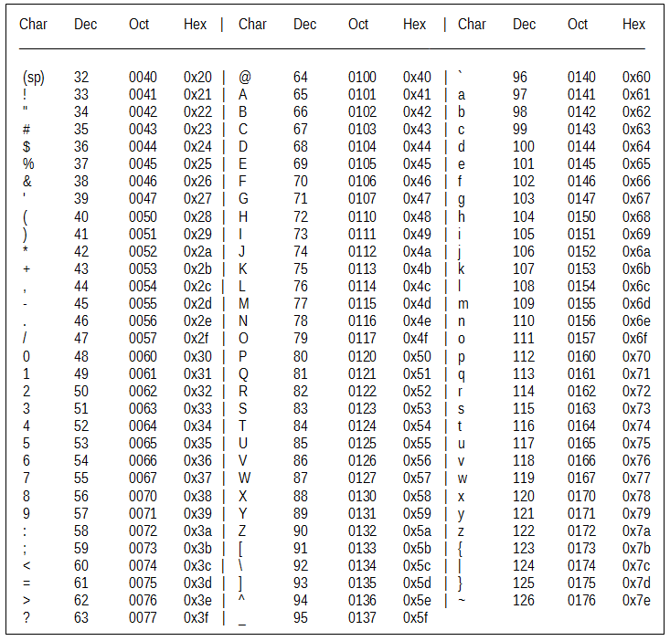

<style>
img[alt~="center"] {
  display: block;
  margin: 0 auto;
}
</style>

# Tutorial 02 - 16.11.2020

Group 02 - Moritz Makowski

<br/>

## Data Types, Boolean Logic, Arithmetic and Control Flow

---

## Today's Agenda

-   Data Types
-   **Exercise 2.1: Data Types**
-   Boolean Logic
-   **Exercise 2.2: Boolean Logic**
-   Arithmetic
-   **Exercise 2.3: Arithmetic**
-   Control Flow - `if`/`else` and `while`
-   **Exercise 2.4: Control Flow**
-   **Exercise 2.5: FizzBuzz**

---

## What Are Data Types?

> In computer science and computer programming, a data type (...) is an attribute of data which tells the compiler (...) how the programmer intends to use the data.

Source: [Data Types @ Wikipedia](https://en.wikipedia.org/wiki/Data_type)

So every data point can be stored and interpreted in different ways.

---

## Data Types: Integers

Integers (whole numbers _(ganze Zahlen)_, often indicated with $\mathbb{Z}$ in mathematics) are **whole numbers with no fractional parts** (no decimal points, etc.).

<br/>

How can we define an integer in our code?

```c
int a = 15;
int b = 327903;
int c = -2873;
```

---

## Different Integer Types - #1

There are a few **integers types** which can store **different sizes** of numbers. Small Integers:

```c
// 1 byte, signed, [-128, 127]
signed char num = 1;

// 1 byte, unsigned, [0, 255]
unsigned char num = 1;


// 2 byte, signed, [-32.768, 32.767]
short num = 1;

// 2 byte, unsigned, [0, 65.535]
unsigned short num = 1;
```

_You don't have to remember the exact size of each type._

---

## Different Integer Types - #2

Large Integers:

```c
// 2 or 4 byte, signed, [-32.768, 32.767] or [-2.147.483.648, 2.147.483.647]
int num = 1;

// 2 or 4 byte, unsigned, [0, 65.535] or [0, 4.294.967.295]
unsigned int num = 1;


// 8 bytes, signed, [-9.223.372.036.854.775.808, 9.223.372.036.854.775.807]
long num = 1;

// 8 bytes, unsigned, [0, 18.446.744.073.709.551.615]
unsigned long num = 1;
```

_You don't have to remember the exact size of each type._

---

## Data Type: Floating Point Number

Floating-point numbers are numbers that **_can have_ a fractional component** (Numbers with digits after the decimal point). These are the real numbers, indicated by R in mathematics.

<br/>

How can we define a floating point number in our code?

```c
float a = 15.3;
float b = 32790;
float c = -2873.078;
```

<br/>

Integer values can also be represented by floating-point numbers. Their fractional component is simply 0. However if the fractional component is always 0 it is more efficient and considered _good practice_ to use an integer interpretation.

---

## Different Floating Point Types

As with integers, there are a few **floating point types** as well which can store **different sizes** of numbers.

```c
// 4 byte, single precision, [1.2E-38, 3.4E+38]
// Precision to 6 decimal places
float num = 1.0;

// 8 byte, double precision, [2.3E-308, 1.7E+308]
// Precision to 15 decimal places
double num = 1.0;

// 10 byte, [3.4E-4932, 1.1E+4932]
// Precision to 19 decimal places
long double num = 1.0;
```

_You don't have to remember the exact size of each type._

---

## Data Type: Character

The third important data type in C are characters. For explanation purposes, a character is a single letter, number, symbol, or element of whitespace (space, tab, newline, etc.).

How can we define a character in our code?

```c
char a = 'm';
char b = 'o';
char c = 114;  // stores 'r' -> See ASCII
```

**Important:** You have to use **single quotes `'...'`** and not double quotes `"..."` for single characters.

---

Note that char technically stores an integer-type number (which is even smaller than `short`). Whether the value is treated as a character or an integer depends on the context.

Which character belongs to which number is defined in the **ASCII-table**:



---

## Why Did We Mention the Different Data Type Sizes?

An important point that we’ll discuss later is that **each different data type can take up a different amount of space in the computer’s memory**. When we declare a variable to be of a certain type, we are telling the compiler how much space it will take up as well as what kind of value to expect to be in that variable. (You don’t need to worry about this now - just keep it in mind.)

---

## Signedness

In C/C++ every data type is **signed by default.**

To define a variable to be unsigned, define it as follows:

```c
unsigned <data_type > <variable_name>;
```

<br/>

Example:

```c
signed char a;
unsigned char b;
```

Possible values of `signed char` are: `[−128, 127]`
Possible values of `unsigned char` are: `[0, 255]`

---

## **Exercise 2.1: Data Types**

**(a)** Which data types can each of the following be?

```c
* 1
* 159.6
* 'c'
* '7'
* 2387923
* '-'
```

**(b)** Find cases in which it makes sense to use an unsigned data type.

<br/>

_(Number 2.1, because second tutorial, first exercise)_

---

## Boolean Logic

Another important concept in programming is a kind of logic called Boolean logic. Boolean logic works with **only two values: _true_ and _false_** (sometimes represented as **1** and **0**, respectively).

However, C by itself does not know about boolean values. But a variable is **true if it is NOT equal to 0**.

```c
int a =   0; // false
int b =   1; // true
int c =  20; // true
int c = -10; // true
```

<br/>

_There is library called `<stdbool.h>` but most times its easier to just use integers. See `example_2_1_boolean.c` on GitHub._

---

## Boolean Operators

There are three boolean operators used in C and C++: **AND** (represented as **&&**), **OR** (represented as **||**), and **NOT** (represented by **!**).

**NOT** operator:

```c
!0 // true
!1 // false
```

---

**AND** operator:

```c
0 && 0 // false
0 && 1 // false
1 && 0 // false
1 && 1 // true
```

**OR** operator:

```c
0 || 0 // false
0 || 1 // true
1 || 0 // true
1 || 1 // true
```

There are other boolean operators (NAND, XOR, ...), but these can be expressed with the three operators listed above.

---

## **Exercise 2.2: Boolean Logic - #1**

**(a)** Give the result of the following boolean expressions:

```c
  a) true && true
  b) true && false
  c) false && false
  d) false && true
  e) !false
  f) !true
  g) !(!true)
  h) true || true
  i) false || true
  j) false || false
  k) false || !(true)
  l) !(false || true)
  m) (true && false) || false
```

---

## **Exercise 2.2: Boolean Logic - #2**

**(b)** Let `x = 29` and `y = -1` be two signed integers. Evaluate the truth value of the parts in parentheses, and give the result of any boolean expressions:

```c
  a) (x > 0)
  b) (y < 0)
  c) (x > 0) && (y < 0)
  d) (y > 0)
  e) (x > 0) && (y > 0)
  f) (x > 0) || (y > 0)
  g) (x > y)
```

<br/>

**(c)** What is the difference between the `==` operator and the `=` operator?

---

## **Exercise 2.2: Boolean Logic - #3 (Bonus)**

**(d)** How can you implement a **NAND** logic in C?

**(e)** How can you implement a **XOR** logic in C?

---

## Arithmetic

In C/C++ (and virtually all other programming languages):

-   Addition by using the `+` operator
-   Subtraction by using the `−` operator
-   Multiplication by using the `∗` operator
-   Division by using the `/` operator
-   Modulo by using the `%` operator

---

## What Is Overflow?

What will be printed out when running the following script?

```c
#include <stdio.h>

int main() {
    unsigned char a = 254;
    unsigned char b = 4;
    unsigned char ab = a + b;
    printf("\n%d", ab);
    return 0;
}
```

_Remember: `unsigned chars` can only store 8 bits of information - Range = `[0, 255]`_.

_See `example_2_2_overflow.c` on GitHub._

---

## Integer Division and the Remainder - #1

What will be printed out when running the following script?

```c
#include <stdio.h>

int main() {
    int a = 11;
    int b = 3;
    float c = a/b;
    printf("\n%f\n", c);
    return 0;
}
```

---

## Integer Division and the Remainder - #2

If both numerator _(Zähler)_ and denominator _(Nenner)_ are integers, then the remainder of the mathematical division is ignored, even if stored inside a `float`.

You can modify the code by defining either `a` or `b` as a `float` instead of an `int`.

<br/>

_See `example_2_3_integer_division.c` on GitHub._

<br/>

However there might be some cases, where this behavior is desired.

---

## Integer Division and the Remainder - #3

You can get just the remainder of an operation by using the modulo operator.

```c
#include <stdio.h>

int main() {
    int a = 11;
    int b = 3;
    int c = a % b;

    printf("\n%d\n", c);

    return 0;
}
```

_See `example_2_4_division_remainder.c` on GitHub._

---

## **Exercise 2.3: Arithmetic - #1**

**(a)** Basic arithmetic operators - evaluate the following:

```
  a) 8 * 8
  b) 45 + 45
  c) 5 / 5
  d) 16 - 4
  e) 3.0 / 2.0
  f) 3 / 2
  g) 3 / 2.0
  h) 3.0 / 2
```

---

## **Exercise 2.3: Arithmetic - #2**

**(b)** Integer arithmetic - evaluate the following:

```
  a) 65 / 8
  b) 65 % 8
  c) 15 / 4
  d) 15 % 4
  e) 16 % 4
  f) 99 % 10
  g) 159999 % 160000
```

<br/>

**(c)** How could you use the modulo operator to determine whether a number was even _(gerade)_ or odd _(ungerade)_?

---

## **Exercise 2.3: Arithmetic - #3**

The following code displays a random integer between `0` and `RAND_MAX` ( = $2^{32}-1$).

```c
#include <stdio.h>
#include <stdlib.h>
#include <time.h>

int main() {
    srand(time(NULL));
    int my_random = rand();
    printf("%d\n", my_random);
}
```

**(d)** How can you make it display a number between `0` and `41` (included)? _(Code on GitHub)_

You can ignore the line `srand(time(NULL));`.

---

## Control Flow - `if`/`else` - #1

In most computer programs there is some decision to be made, on which operation to execute. Simple example:

```c
if (traffic_light_is_red) {
  stay_put();
} else {
  cross_the_street();
}
```

The method `stay_put()` will only be executed, if the condition `traffic_light_is_red` is `true`. Otherwise `cross_the_street()` will be executed.

---

## Control Flow - `if`/`else` - #2

You can have no `else` case at all:

```c
if (hungry) {
  eat_something();
}
```

Or you can have multiple `else` cases:

```c
char letter = ...;

if (letter == 'a') {
  method1();  // Only executed if (letter == 'a')
} else if (letter == 'b') {
  method2();  // Only executed if ((letter != 'a') && (letter == 'b'))
} else {
  method4();  // Only executed if ((letter != 'a') && (letter != 'b'))
}
```

---

## Control Flow - `while` - #1

If you want to repeat a certain task `n` times, you shall not copy and paste that code `n` times. Most times this `n` even changes at runtime (during the programs execution).

<br/>

Example of a `while`-loop:

```c
while (!tired) {
  read_chapter();
}
```

As long as `!tired` is `true`, `read_chapter()` will be executed. **Before** every execution the program will check whether `!tired` still is `true`, and run `read_chapter()` again.

---

## Control Flow - `do ... while` - #2

There is another version of this `while`-loop written like this:

```c
do {
  read_chapter();
} while (!tired);
```

The difference to `while` is, that no matter what value is stored in `tired` the loop will execute at least one time.

`do ... while` first checks the status of `!tired` right **after** the first execution.

---

_We will have a look at `for`-loops and `switch`-statements next week!_

---

## **Exercise 2.4: Control Flow — `while` and `if`/`else` - #1**

**(a)** What does the following code do? _(Code on GitHub)_

```c
#include <stdio.h>

int main(){
  int count = 1;
  while(count <= 100) {
    printf("Number is %d\n", count++);
  }
}
```

**(b)** What’s the significance of count++? What is the difference to ++count?

**(c)** What happens if ++ is removed altogether?

---

## **Exercise 2.4: Control Flow — `while` and `if`/`else` - #2**

**(d)** Write a program that uses a **while loop** to generate and print **100 random numbers between `0` and `41`** (included) using the `rand()` function. _(Code on GitHub)_

**(e)** Enhance your program to print **“Higher”** if the random number is greater than or equal to `21` and **“Lower”** if it is less than `21`. _(Code on GitHub)_

**(f)** Enhance your program to **count** the number of random numbers that are greater than or equal to `21` and **print that number**. _(Code on GitHub)_

**(g)** How large would you expect this number to be? Explain your reasoning.

---

## **Exercise 2.5: FizzBuzz (Bonus) #1**

The task is to print all numbers from 1 to 100 (included) but:

-   If the number is divisible by 3 (and not by 5), print `Fizz` instead.
-   If the number is divisible by 5 (and not by 3), print `Buzz` instead.
-   If the number is divisible by both 3 and 5, print `FizzBuzz` instead.

<br/>

_(Code on GitHub)_

---

## **Exercise 2.5: FizzBuzz (Bonus) #2**

So your output should look exactly like this:

```
1
2
Fizz
4
Buzz
Fizz

...

14
FizzBuzz
16

...
```

---

## See You Next Week!

All **code examples** and **exercise solutions** on **GitLab** (solutions right after my tutorial):
https://github.com/dostuffthatmatters/IN8011-WS20

<!-- Generated with https://www.qrcode-monkey.com/de -->


---


