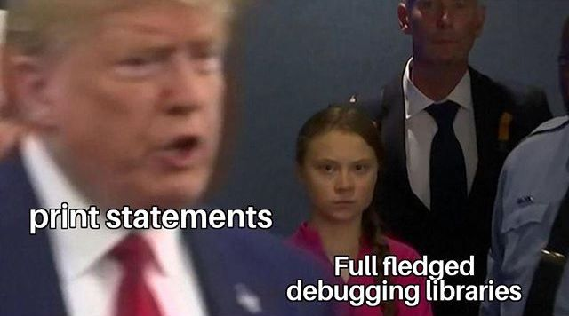

<style>
img[alt~="center"] {
  display: block;
  margin: 0 auto;
}
</style>

# Tutorial 03 - _tbd_.11.2019

Group _tbd_ - Moritz Makowski

<br/>

## File Structure, I/O and More Control Flow

---

## Today's Agenda

-   Basic Source File Structure
-   What is I/O?
-   Printing to the console with `printf`
-   Character Arrays
-   Reading from the Console with `gets` and `scanf`
-   String-Integer Conversion with `atoi`
-   **Exercise 3.1: I/O**
-   Control Flow: `for` and `switch`
-   Control Flow: `break` and `continue`
-   **Exercise 3.2: I/O and Control Flow**

---

## Basic Source File Structure

Example Script:

```c
#include <stdio.h>

int main(int argc, char** argv) {

  int k, m;
  unsigned short foo = 0;
  float x, y;

  /* some instructions */

  return 0;

}
```

---

## 1. Imports

The file usually begins with a section consisting of the libraries we need to **`include`** in our program.

**Libraries provide functionality** that the C language itself doesn’t provide.

<br/>

Example:

```c
#include <stdio.h>
```

In this case, we include **`stdio.h`**, which provides basic **input/output functions** for C (like `printf`, `scanf` and `gets`).

---

## 2. Main Function

The **`main`** function of our program is the **"main entry point"**. When we execute our compiled program this function will be called.

_We will learn about functions later!_

For now, just remember: Every program that you want to execute on its own needs a `main` function. The logic inside that main function is the overall logic of you program.

```c
int main(int argc, char** argv) {

  /* some instructions */

}
```

_You can ignore what `argc` and `argv` means for now. You can just use `int main() {}`._

---

## 3. Variable Declarations

It is often useful to declare as many variables as possible in one place - preferrably at the beginning of your program.

This **improves readability** a lot.

<br/>

```c
int main(int argc, char** argv) {

  int k, m;
  unsigned short foo = 0;
  float x, y;

  ...
}
```

---

## 4. The Program's Logic

After you have included all the necessary libraries and declared all variables, you can move on to you program's logic itself.

```c
int main(int argc, char** argv) {

  ...

  /* the programs functionality */

  ...

}
```

---

## 5. Return Statement of the Main Function

At the **end of your main function** you have to return some value. For the main function this value is also called **"Exit Code"**.

The Exit Code inidicates, whether a program has executed successfully (`Exit Code 0`) or if it encountered any errors (Exit Codes other than 0, not really standardized).

```c
int main(int argc, char** argv) {

  ...

  return 0;

}
```

---

On _Mac/Linux_ you will see the Exit Code automatically.
On _Windows_ you have to type in `echo $`.

<br/>

**Important:** Every line of code after a return statement - that has been "executed" - will be ignored. _We will come back to that once we learn about functions._

<br/>

You can also create your own Exit Codes to see where exactly your program stopped executing. _See `example_3_1_exit_code.c` on GitHub._

---

## A Little Bit of I/O

I/O stands for **Input/Output**. In most programs you will want to pass some data to your program **at runtime** and see the results of the program's calculations.

<br/>

**"At runtime"** basically means **"while the program is executing"**.

If you change a value inside your code, recompile it and run it again, you did not pass that value at runtime. At runtime means that you don't have to change your code and therefore don't have to recompile it. The program will fetch that data during its execution lifecycle.

<br/>

The simplest form of passing data from a program and back is by comminucating via the console itself.

---

## Printing to the Console

You can use `printf()` to print to the console. This function is part of the library `<stdio.h>` so you have to include that library.

Example:

```c
#include <stdio.h>

int main() {
  int a = 13;
  float b = 4.2;
  char c = 'p';

  printf("My variables are: %d, %f, %c", a, b, c);

  return 0;
}
```

---

## Format Specifiers

Format Specifiers are used to insert values of variables into our printed text. Inside the `printf("My variables are: %d, %f, %c", a, b, c);` statement:

-   the value of `a` is getting printed instead of `%d`
-   the value of `b` is getting printed instead of `%f`
-   the value of `c` is getting printed instead of `%c`

<br/>

A few possible format specifiers:

`%d` for integers, `%f` for floating point numbers, `%c` for single characters.

<br/>

_Watch What happens when you change the `%c` in the print statement to `%d`._ Why is that?

---

## Special Characters

You can not only print characters from the alphabet, numbers and symbols like `!` / `?`, but also **new lines**, **tabs** and much more.

Examples:

-   `\n` will print a new line - as if you would've hit `enter`
-   `\t` will print a tab
-   `\\` will print `\`
-   `%%` will print `%`
-   `\"` will print `"`
-   `\'` will print `'`
-   `\0` is the `NULL` character - _we will use it later on_

---

## Short Introduction to Character Arrays

When we want to read something, the user typed into the console, we have to store that data somewhere.

This data will probably consist of more than one character so one `char` won't suffice.

<br/>

We can however store a **list** (also called **array**) of `chars`. We call these arrays of characters **"strings"** _(Zeichenketten)_.

<br/>

_We will cover arrays in detail next week!_

---

## Initializing Character Arrays

C does not initialize memory to 0. So when you just initialize the char array with `char input[8];` there will be random entries in that string.

_See `example_3_2_char_array.c` on GitHub._
_It doen't matter if you use `{'\0'}` or `{0}`_

<br/>

```c
int main() {
    // This variable can store up to 7 characters
    // After saying '= {0};' the whole array will be 0
    char input[8] = {0};

    // The %s will print the whole string
    // and not just one character as with %c
    printf("%s", input);

    return 0;
}
```

---

**Why is `char input[8] = {0};` only able to store 7 characters and not 8?**

The last character of a string stored in memory always has to be `'\0'` (`NULL`) otherwise the print function doesn't know when to stop reading/printing the string.

---

## The Dilemma with Reading from the Console - #1

There are two functions you can use to read in something that the user has typed into the console: `gets()` and `scanf()`.

<br/>

However, **I do not recommend you to use `gets()`**.

_See `example_3_3_basic_IO_really_unsafe.c` on GitHub and type in something that is longer than 8 characters._

---

## The Dilemma with Reading from the Console - #2

**`Scanf()` is better** because you can specify how many characters you want to read in. However an issue comes up when you want to scan in multiple values (with multiple `scanf()`-calls) and you type in more characters than one `scanf()` reads in.

_See `example_3_4_basic_IO_unsafe.c` on GitHub and type in something that is longer than 8 characters._

---

## The Solution for Reading from the Console - #3

But there is a solution for that! You have to **"flush"** all elements that haven't been read **before every new `scanf()`-call**.

_See `example_3_5_basic_IO_safe.c` on GitHub and type in something that is longer than 8 characters._

---

## _Super Bonus:_ Indexing an Array

Can you figure out what the following function does? What does `char_array[i]` mean?

```c
void print_char_array(char* char_array, int length) {
    printf("\n");
    for (int i=0; i<length; i++) {
        printf("\nIndex %d: %c", i, char_array[i]);
    }
    printf("\n\n");
}
```

_Hint: Have a look at `example_3_5_basic_IO_safe.c` where it visualizes the char arrays._

---

## Integer-String-Conversion with `atoi()` - #1

The following code uses the function `atoi()` from the library `stdlib.h` to convert an integer into a string.

```c
#include <stdlib.h>

...

char input[8] = {'\0'};
scanf("%7s", input);
int number = atoi(input);
```

---

## Integer-String-Conversion with `atoi()` - #2

If `input` is empty (does not contain any characters other than `'\0'`) or if the first character is a non-integer character, then `number` is set to `0`.

Otherwise `atoi` reads `input` as a decimal number up to the first non-integer character.

Examples:

-   `""` -> `0`
-   `"s56"` -> `0`
-   `"12"` -> `12`
-   `"14ab34"` -> `14`

<br/>

_See `example_3_6_atoi.c` on GitHub._

---

Text-based I/O is kind of annoying, I now ...

The next topic will be more interesting!

---

## **Exercise 3.1: I/O**

**(a)** Write a short program that declares a string buffer and uses `scanf()` to take an input from the console and directly print that output back to the user.

**(b)** Write a short program which takes a number from the command line, turns it into an integer, stores it in an integer variable and prints the number to the user.

**(c) _(Bonus)_** Write a short program which takes a string from the command line, stores the first character in a character variable and then prints that character.

---

## Control Flow - `for`-Loops - #1

Last week we've covered `while`-loops and used them to repeat snippets of code multiple times. There is another type of loop which is more convenient in most cases: A `for`-loop.

<br/>

Example:

```c
for (int i=0; i<100; i++) {
  printf("\n%d", i);
}
```

<br/>

The **loop variable** `i` (_"iterator"_ or _"index"_) is available inside the loop.

---

## Control Flow - `for`-Loops - #2

A more **formal description**:

```c
for (<initialization>; <condition>; <increment>) {
  <body>
}
```

At the beginning of the loop a **"loop variable"** is initialized. **Before** every execution, the **"loop condition"** is checked and the **"loop body"** will only be executed if this condition is `true`. **After** every execution of the loop, the **"loop increment"** (statement) will be executed.

<br/>

_See `example_3_7_for_loop.c` on GitHub._

---

## Control Flow - `switch`-Statements - #1

You want to avoid long `if` / `else if` / `else if` / `...` / `else` chains whenever possible. A good alternative is to use a `switch`-statement.

```c
switch (number) {
  case 1:
    method1();
    break;

  case 2:
    method2();
    break;

  default:
    method3();
    break;
}
```

---

## Control Flow - `switch`-Statements - #2

The variable `number` has to be an integer and all cases can only contain integer numbers (no comparison statement with `number` and `...`).

<br/>

We include the `break`-keyword so the execution of the whole `switch`-statement is abandoned once we hit a valid case.

<br/>

If no case has been executed the `default`-case will fire.

---

## Some Facts for the Super-Curious

The default block can be placed anywhere. The position of default doesn’t matter, it is still executed if no match found.

<br/>

All the statements following a matching case execute until a break statement is reached.

_See `example_3_8_switch.c` on GitHub, remove some of the `break`-keywords and see what happens._

<br/>

_Have some more: https://www.geeksforgeeks.org/interesting-facts-about-switch-statement-in-c/_

---

## Using `break` in Loops

When the `break`-keyword is used in loops, the execution of the whole `loop` is abandoned - no matter the loop condition.

<br/>

Example: Calculating the least common multiple (_kleinstes gemeinsames Vielfaches_).

```c
for (int i=1; i<1000; i++) {
  if ((i%3 == 0) && (i%4 == 0) && (i%5 == 0)) {
    printf("\nThe least common multiple of 3, 4 and 5 is %d.\n", i);
    break;
  }
}
```

What will be printed out?

---

## Using `continue` in Loops

When the `continue`-keyword is used in loops, this execution cycle of the whole `loop` is stopped and the loop jumps to the next cycle.

<br/>

```c
for (int i=1; i<1000; i++) {
  if (!((i%3 == 0) && (i%4 == 0) && (i%5 == 0))) {
    continue;
  }
  printf("%d\n", i);
}
```

What will be printed out?

---

## **Exercise 3.2: I/O and Control Flow**

**(a)** Write a program that accepts two numbers `a` and `b` and prints out the **largest common denominator of `a` and `b`** (größter gemeinsamer ganzzaliger Teiler).

**(b)** Write a program that accepts two numbers `a` and `b` and prints out **all prime numbers between `a` and `b`** (both included).

**(c)** Write a program that accepts a number and prints out, whether that **number is a prime or not**. After the result is printed out. Ask the user for another number (infinite loop).

**(d) _(Bonus)_** Handle the cases for **(a)**, **(b)** and **(c)** where the user enters a string where `atoi()` returns `0` by displaying an error message and asking the user to enter a valid number.

<br/>

_Hint: Evaluate the passed numbers with `atoi()`._

---

## See You Next Week!

All **code examples** and **exercise solutions** on **GitHub** (solutions right after my tutorial):
https://github.com/dostuffthatmatters/IN8011-WS20

<br/>

<!-- Generated with https://www.qrcode-monkey.com/de -->


---


