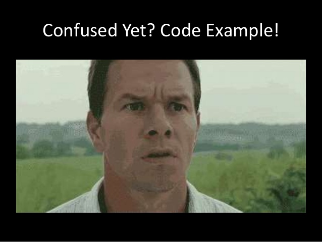
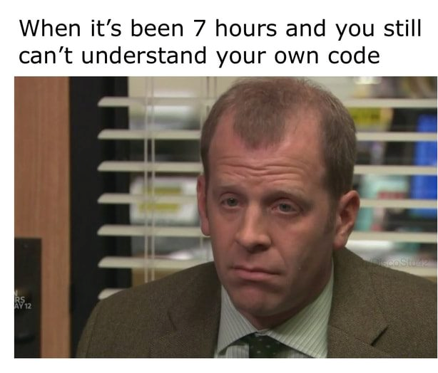
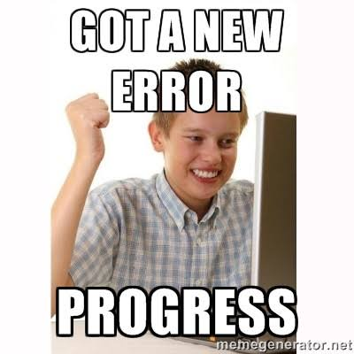

<style>
img[alt~="center"] {
  display: block;
  margin: 0 auto;
}
h1, h2, h3, h4, h5, h6, p, a, li {
  font-family: "Panton", sans-serif;
}
strong {
    font-weight: 600
}
</style>

# Tutorial 04 - 30.11./03.12.2020

Group 02/11 - Moritz Makowski - moritz.makowski@tum.de

<br/>

## Arrays, Functions, Scope and Readability

---

## Homework Feedback

* Use inline values when only using them once
* `for` instead of `while`
* External `for`-variables can be useful
* Constant indentation! (Also covered today)
* No special characters/umlaute
* Column 80
* Remove all `printf`-statements before submitting

---

## Today's Agenda

-   Arrays
-   **Exercise 4.1: Arrays**
-   Functions
-   **Exercise 4.2: Functions**
-   Scope
-   What Makes Code Readable?
-   **Time for more practice/questions**

---

## What are Arrays?

You often want to store a lot of related variables with the same type in one place.

<br/>

The following code is not very pleasant to read:

```c
int a_1 = 14;
int a_2 = 23;
int a_3 = 87;
int a_4 = 30;
...
```

<br/>

Use an array instead:

```c
int a[10] = {14, 23, 87, 30, ...};
```

---

## Ways of Declaring an Array - #1

The number placed inside the square brackets defines the length of the array = how many elements can be stored in it.

You can only store values of one specific data type in one array.

<br/>

```c
// Store up to 10 integers
int my_array_1[10];

// Store up to 100 floats
float my_array_1[100];

// Store up to 1000 chars (Careful: Watch out for '\0’!)
char my_array_1[1000];
```

---

## Ways of Declaring an Array - #2

You can either declare an array without initializing its content ...

```c
int my_array[10];
// my_array now stores random stuff
```

<br/>

... or declare it with initializing its content to zero ...

```c
int my_array[10] = {0};
// my_array now stores {0, 0, 0, ...}
```

---

## Ways of Declaring an Array - #3

You can explicitly list all elements to be stored:

```c
int my_array[10] = {1, 2, 3, 4, 5, 6, 7, 8, 9, 10};
```

<br/>

If you don't list all elements, the rest of the array gets initialized to zero:

```c
int my_array[10] = {1, 2, 3};
// my_array now stores {1, 2, 3, 0, 0, ...}
```

---

## Reading Elements from the Array

To access a particular element inside the array you use the square brackets again:

```c
int my_array[10] = {1, 4, 9, 16, 25}

int number_at_spot_3 = my_array[2];  // number_at_spot_3 == 9
```

<br/>

The number used inside the square brackets to reference the element is called **index**. Retrieving an element from an array is also called **"indexing"**. The index of a list **starts a `0`**!

<br/>

**Important:** C does not remember the size of your array! That is your job as a programmer.

---

## Overwriting Elements Inside the Array

You can also use that square bracket notation to rewrite specific elements of that array.

```c
int my_array[5] = {1, 4, 9, 10, 25}

my_array[3] = 16;

// my_array now stores {1, 4, 9, 16, 25}
```

---

You can find an example of the ways of declaring, initializing and redefining arrays: _See `example_4_1_arrays.c` on GitHub._

---

## **Exercise 4.1: Arrays**

**(a)** Declare an array storing the numbers from `1` through `10` and print out its content (each element on a new line).

**(b)** Declare an array storing the numbers from `1` through `10` and overwrite each element with its squared value (`{1, 2, 3, ...}` -> `{1, 4, 9, ...}`).

---

## What are Functions?

With functions you can **break your code apart in small blocks** each being responsible for exactly one task.

<br/>

You have used functions before! Example:

```c
printf("Hello World!");
```

What this code does is, it **delegates** a specific task (printing out something) to another piece of code that has already been written for you. When using functions you can reuse code as often as you want!

---



---

## Example: Printing out the contents of an array - Bad version

```c
#include <stdio.h>

int main() {

    int max = 10;

    int my_array_1[10] = {1, 2, 3, 4, 5, 6, 7, 8, 9, 10};
    int my_array_2[10] = {1, 2, 3};

    printf("\nPrinting array with length %d", max);
    for (int i=0; i<max; i++) {
        printf("\nIndex %d -> Value %d", i, my_array_1[i]);
    }
    printf("\n");

    printf("\nPrinting array with length %d", max);
    for (int i=0; i<max; i++) {
        printf("\nIndex %d -> Value %d", i, my_array_2[i]);
    }
    printf("\n");

    return 0;
}
```

---

## Example: Printing out the contents of an array - Good version

```c
#include <stdio.h>

void print_int_array(int *array, int max) {
    printf("\nPrinting array with length %d", max);
    for (int i=0; i<max; i++) {
        printf("\nIndex %d -> Value %d", i, array[i]);
    }
    printf("\n");
}

int main() {

    int max = 10;

    int my_array_1[10] = {1, 2, 3, 4, 5, 6, 7, 8, 9, 10};
    int my_array_2[10] = {1, 2, 3};

    print_int_array(my_array_1, max);  // Function call
    print_int_array(my_array_2, max);  // Function call

    return 0;
}
```

---

## How to write a function

This line is called the **method signature** which uniquely identifies this function. You cannot use the same function name twice (in the same scope).

```c
void print_int_array(int *array, int max)
```

<br/>

The functions **body** is executed every time the function is called.

```c
{
    printf("\nPrinting array with length %d", max);
    for (int i=0; i<max; i++) {
        printf("\nIndex %d -> Value %d", i, array[i]);
    }
    printf("\n");
}
```

---

_Clarification: `method` and `function` are terms for basically the same thing._

---

```c
void print_int_array(int *array, int max)
```

Inside the method signature we define a few things:

-   `void` means that the function does not return a value (Explained in a few slides)
-   `print_int_array` is the functions name
-   `(int* array, int max)` are **function parameters** that are **passed to the function**

**We can use all parameters inside the functions body** as we would use regular variables.

---

See how the parameters `array` (array of integers) and `max` (integer) are used inside the function's body:

```c
void print_int_array(int *array, int max) {
    printf("\nPrinting array with length %d", max);
    for (int i=0; i<max; i++) {
        printf("\nIndex %d -> Value %d", i, array[i]);
    }
    printf("\n");
}
```

---

## What does it mean to `return` something?

Blocks of code can not only execute stuff (`printf`, etc.) but also calculate stuff.

Let's say we want to multiply some number `n`, `m`-times with itself ($n^{m}$).

```c
// calculates n^m
int power(int n, int m) {
    int result = 1;
    for (int i=0; i<m; i++) {
        result = result * n;
    }
    return result;
}
```

_See `example_4_2_return.c`._
_You can also use `pow(n, m)` from the library `math.h` for that._

---

## What does it mean to `return` something?

```c
#include <stdio.h>

// calculates n^m
int power(int n, int m) {
    int result = 1;
    for (int i=0; i<m; i++) {
        result = result * n;
    }
    return result;
}

int main() {
    int n = 3;
    int m = 4;

    int my_number = power(n, m);
    // The variable 'my_number' is now equal to the
    // variable 'result' from inside the 'power'-function

    printf("%d^%d = %d", n, m, my_number);
    return 0;
}
```

---

## What does it mean to `return` something?

**`return` specifies the value a function evaluates to.** In this case the return value of `power(...)` is equal to $n^m$. The return value is an integer so we have to specify that in the method signature: That is why the signature is:

```c
int pow...
```

<br/>

Functions that do not `return` anything look like this:

```c
void <method_name>(<method_parameters>) {...}
```

---

## `return` stops a functions execution

What do you think will be printed out? _See `example_4_3_return_stop.c` on GitHub_

```c
#include <stdio.h>

int power(int n, int m) {
    int result = n;
    for (int i=1; i<m; i++) {
        result = result * n;
    }
    return result;
    printf("result is %d\n", result);
}


int main() {
    int my_number = power(3, 4);
    printf("my_number is %d", my_number);
    return 0;
}
```

---

## Benefits of making use of functions

-   Specific **functionality is encapsulated**
-   **More readable code** (especially if you name your functions appropriately)
-   **Way easier to debug** than one long block of code

---

**A lot of progress today!**

---

## **Exercise 4.2: Functions - #1**

**(a)** Write a program that prints out a tree. The tree-printing should happen in a separate function `print_tree(...)` and take in the number number of tree-lines.

Example: Calling `print_tree(3)` in your `main`-function will look like this:

```txt
  *
 ***
*****
```

Calling `print_tree(5)` in your `main`-function will look like this:

```txt
    *
   ***
  *****
 *******
*********
```

---

## **Exercise 4.2: Functions - #2**

**(b)** Write a function `is_prime(...)` that takes in one number and returns an integer (`1` if the number is a prime and `0` if not).

**(c)** Write a function `is_binary(...)` that loops over a char array and returns an integer (`1` if the string only contains `'0'`s and `'1'`s and `0` if not).

_You always have to pass the arrays length next to the actual array as a parameter!_

---

## Let's talk about Scope

A variable's/function's scope is the part of the code from where it is visible/from where it can be called.

You can only access/modify a variable inside its scope!

---

## Global Scope

```c
#include <stdio.h>

int counter = 0; // Is accessible from everywhere inside this file

void a() {counter++;}

void b() {counter++;}

int main() {
    a();
    b();
    a();
    printf("Counter is now %d\n", counter);
    return 0;
}
```

_See `example_4_4_gobal_scope.c`._

---

## Local Scope - #1

```c
#include <stdio.h>

void a() {counter++;}

void b() {counter++;}

int main() {
    int counter = 0; // Is only accessible from inside 'main'
    a();
    b();
    a();
    printf("Counter is now %d\n", counter);
    return 0;
}
```

This file cannot be compiled because `counter` is being accessed from outside its scope.

---

## Local Scope - #2

```c
#include <stdio.h>

int main() {
    for (int i=0; i<10; i++) {
        // The variable 'i' is only accessible from inside the loop
        printf("i is now %d\n", i);
    }

    printf("Outside: i is now %d\n", i);
    return 0;
}
```

This file cannot be compiled because `i` is being accessed from outside its scope.

<br/>

_See `example_4_5_a_local_scope.c` and `example_4_5_b_local_scope.c`._

---

## Scope and Functions - Faulty Version

```c
#include <stdio.h>

void increment_by_4 (int number) {
    // A local copy of the variable `number` has been created.
    // Only that local copy will be incremented. The variable
    // 'number' inside the main function remains untouched
    number = number + 4;
}

int main() {
    int number = 3;
    increment_by_4(number);
    printf("Outside: number is now %d\n", number);
    return 0;
}
```

_See `example_4_6_a_local_scope_.c`._

---

## Scope and Functions - Correct Version

```c
#include <stdio.h>

int increment_by_4(int number) {
    // Use a return statement to pass the calculated value back to 'main'
    return number + 4;
}

int main() {

    int number = 3;
    number = increment_by_4(number);

    printf("Outside: number is now %d\n", number);

    return 0;
}
```

_See `example_4_6_b_local_scope.c` on GitHub._

---

I will cover the keyword `static` in two weeks when we will learn how to work with multiple files.

---

## Why Should You Write Readable Code?

-   Code is read about 10 times as much as it is written.

-   Putting a little bit of effort into writing **clean code saves you and your coworkers a ton of time!**

-   Organized code is **way easier to be made efficient** because it is very clear to you what is going on.

---



---

## Readable Code: 1. Consistent Style

-   Consistent **naming of variables**:

    ```c
    // Bad
    int my_number_1, mySecondNumber;

    // Good
    int my_number_1, my_number_2;
    ```

-   Consistent **indentation** and consistently positioned **curly braces** `{`/`}`

---

## Readable Code: 2. Descriptive naming

-   Descriptive variable names

    ```c
    // Bad
    int a, b, c;

    // Good
    int dividend, divisor, remainder;
    ```

-   Descriptive function names

    ```c
    // Bad
    int my_func_1(...);

    // Good
    int is_prime(...);
    ```

---

## Readable Code: 3. Documenting your Code - #1

In order to be able to explain someone what your code does without having to explain it to him in person, you have to write documentation about your code.

The first step in documenting your code is to include **comments next to every non-trivial block of code**.

```c
// Single-Line Comment

/*
Multi-Line Comment
*/
```

---

## Readable Code: 3. Documenting your Code - #2

In C you should comment your functions by using the Doxygen-Format, which looks like:

```c
/**
 * <enter a description of the function 'multiply' here>
 *
 * @param param_a <enter a parameter description here>
 * @param param_b <enter a parameter description here>
 *
 * @return <enter a return-value description here>
 */
float multiply(float param_a, float param_b) {
    ...
}
```

---

## What Difference Readability Can Make

Can you figure out what the program `example_4_7_bad_readability.c` does?

<br/>

Now look at `example_4_8_good_readability.c`, which does exactly the same.

---

## See You Next Week!

All **code examples** and **exercise solutions** on **GitLab** (solutions right after my tutorial):
https://gitlab.lrz.de/dostuffthatmatters/IN8011-WS20

<!-- Generated with https://www.qrcode-monkey.com/de -->


---


