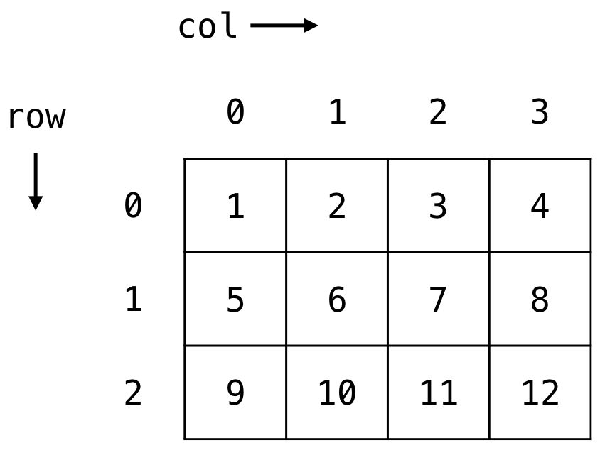

<style>
img[alt~="center"] {
  display: block;
  margin: 0 auto;
}
</style>

# Tutorial 05 - 07.12./10.12.2020

Group 02/11 - Moritz Makowski - moritz.makowski@tum.de

<br/>

## Multidimensional Arrays, Type Casting, Structs and Enums

---

## Today's Agenda

* Revision: Arrays and Functions
* **Exercise 5.1: Arrays and Functions**
* Multidimensional Arrays
* **Exercise 5.2: Matrix Properties**
* Type Casting
* Struct's
* Union's
* Enum's
* **Exercise 5.3: Using Struct's, Union's and Enum's**

---

A short revision of **arrays**.

A short revision of **functions**.

---

## **Exercises 5.1: Arrays and Functions**

**(a)** Return the largest element in a list.

**(b)** Check whether an element occurs in a list.

**(c)** Compute the running total of a list.

**(d)** Test whether a string is a palindrome.

**(e)** Reverse a list. Assume a fixed length of 10 elements!

<br/>

*You can put all your code inside `main` (in the beginning, while testing your logic) and later divide it into functions. You can also start with separate functions right away.*

---

## Multidimensional Arrays

The arrays we know ... `int my_array[10] = ...;` ... are *one-dimensional*. With regular arrays you **"iterate along one dimension"**.

<br/>

However sometimes you want to have more dimensions than one.
Examples: Matrices/Tensors, Tables.

<br/>

You cannot only have two-dimensional arrays but as many dimensions as you need. So you will have **one index for each dimension**.

---

## Example Case: Two-Dimensional Arrays

We refer to the row index as $i$ and to the column index as $j$.

With two dimensions we need to define two sizes: How many rows? How many columns?

<br/>

---

The initialization looks a lot like for regular arrays.

```c
int my_matrix[3][4] = {
  {1, 2, 3, 4},
  {5, 6, 7, 8},
  {9, 10, 11, 12}
};
```



*Image Source: [https://www.dyclassroom.com/](https://www.dyclassroom.com/)*
*See `example_5_1_matrix_initialisation.c` on GitHub.*

---


<br/>

Indexing an array is also very similar to regular arrays:

```c
int value_at_bottom_left = my_matrix[2][0];  // Will return 9
```

---

## Example Usecase: Matrix properties

See: `example_5_2_diagonal_matrix.c`

---

## **Exercise 5.2: Matrix Properties**

I have prepared a `main`-file for you called `exercise_5_2_matrix_main.c`.

You are expected to implement two functions (either inside that file or in a separate file).

**(a)** The function `int is_symmetric(char rows, char columns, int matrix[rows][columns])` returns `1` if the given matrix is symmetric and `0` otherwise.

**(b)** The function `int is_skew_symmetric(char rows, char columns, int matrix[rows][columns])` returns `1` if the given matrix is skew-symmetric and `0` otherwise.

---

## Revisiting Integer Division

When dividing two integers the result will always be an integer even when stored in a float.

```c
int main() {
  int a = 11;
  int b = 5;

  float result = a/b;  // Will store 2.0000...

  return 0;
}
```

---

## Enter "Type Casting"

Inside an equation you can convert variables to other data types so that the will be treated as a variable of their newly assigned type (only inside that equation).

```c
int main() {
  int a = 11;
  int b = 5;

  float result_1 = (float)(a)/b;  // Will store 2.2000...
  float result_2 = a/(float)(b);  // Will store 2.2000...
  float result_3 = (float)(a/b);  // WRONG! Will store 2.0000...

  // The variables a and b themselves did 
  // not change -> Both still of type 'int'

  return 0;
}
```

---

What if we want to **bundle related information of different data types** together?

<br/>

Answer: We can use a **`struct`**!

---

## Example Usecase: Points with 3D Coordinates - Bad

```c
int main() {

  float point_1_x = 12;
  float point_1_y = 8.5;
  float point_1_z = 0.2;

  float point_2_x = 12.1;
  float point_2_y = 7.5;
  float point_2_z = 0.4;

  ...

  return 0;
}
```

---

## Example Usecase: Points with 3D Coordinates - Good

```c
struct point {
  float x;
  float y;
  float z;
}

int main() {

  struct point point_1;
  point_1.x = 12;
  point_1.y = 8.5;
  point_1.z = 0.2;

  struct point point_2;
  point_2.x = 12.1;
  point_2.y = 7.5;
  point_2.z = 0.4;

  return 0;
}
```

---

## Example Usecase: Points with 3D Coordinates - Even Better

```c
struct point {
  float x;
  float y;
  float z;
}

int main() {
  struct point point_1 = {
    .x = 12,
    .y = 8.5,
    .z = 0.2
  };

  struct point point_2 = {
    .x = 12.1,
    .y = 7.5,
    .z = 0.4
  };

  return 0;
}
```

---

## Example Usecase: Points with 3D Coordinates - Perfect

```c
struct point {
  float x;
  float y;
  float z;
}

int main() {
  struct point point_1 = {12, 8.5, 0.2};
  struct point point_2 = {12.1, 7.5, 0.4};

  return 0;
}
```

---

## Why should you use `struct`'s? - #1

1. Cleaner code
2. Less variable names
3. Consistency accross same "object types" is required

---

## Why should you use `struct`'s? - #2

Example usecase: You can loop over an array of structs.

<br/>

*See `example_5_3_struct_array.c` on GitHub.*

---

## Union's 

A `union` can store different data types as well.

**BUT:** All of them get stored in the same spot of memory.

The size of the `union` is determined by its largest component.

<br/>

```c
union my_union {
  int number;       // Takes up 4 bytes
  char letters[2];  // Takes up 2 bytes
}
```

---


---

## Shared Memory Space?

```c
union mix {
  int number;                 // 4 bytes
  struct {short lo, hi;} s;   // 4 bytes
  char letters[4];            // 4 bytes
} m;

// define as integer 'number'
m.number = 0xFF00F00F;  // 1111 1111   0000 0000   11110000   0000 1111

// interpret as struct 's'
m.s.lo;                 // 1111 1111   0000 0000
m.s.hi;                 //                         11110000   0000 1111

// interpret as char array 'letters'
m.letters[0];           // 1111 1111
m.letters[1];           //             0000 0000
m.letters[2];           //                         11110000
m.letters[3];           //                                    0000 1111
```

---

## Enum's

**Example usecase:** Using variables that are supposed to store/represent a state, which is encoded in the form of an integer. E.g. the state of a traffic light.

<br/>

You can now declare the state variable without remembering the encoding for each state:


```c
enum color_1 c = BLUE;

if (c == BLUE) {
  // do something
}
```

---

## Defining Enum's

```c
enum color_1 {
  RED = 1            //  1
  YELLOW,            //  2
  GREEN,             //  3
}

enum color_2 {
  RED,                 //  0
  YELLOW,              //  1
  GREEN = YELLOW + 2,  //  3
  BLUE,                //  4
  GRAY = 17,           // 17
  BROWN                // 18
};
```

---

*See `example_5_4_enums.c` on GitHub.*

---

## **Exercise 5.3: Using Struct's, Union's and Enum's - #1**

**(a)** Create a **`struct rectangle`** for a rectangle containing its length and width as `double` values.

**(b)** Create a **`struct triangle`** for a right triangle containing the length of its hypotenuse and its height as `double` values.

**(c)** Create a **`struct circle`** for a circle containing its radius as `double` value.

**(d)** For each shape, write a function that receives an appropriate `struct` as a parameter and returns its area as a `double`. You can find a constant named `M_PI` in `math.h`.

---

## **Exercise 5.3: Using Struct's, Union's and Enum's - #2**

**(e)** Create an **`enum shape_type`** with a value for each of the shapes created above.

**(f)** Create a **`struct shape`** that uses a `union` to hold any of the shapes created above and in addition an `enum` indicating which type of shape is currently in use.

**(g)** Create a function **`shape_area`** that gets a shape as parameter. The function should then print the type and the area of the contained shape. Finally the function should return the area of the shape as a `double`.

**(h)** Declare a some shapes and check / use your function.

---

## See You Next Week!

All **code examples** and **exercise solutions** on **GitLab** (solutions right after my tutorial):
https://gitlab.lrz.de/dostuffthatmatters/IN8011-WS20

<!-- Generated with https://www.qrcode-monkey.com/de -->


---

