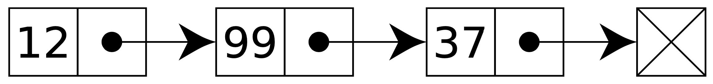

<style>
img[alt~="center"] {
  display: block;
  margin: 0 auto;
}
h1, h2, h3, h4, h5, h6, p, a, li {
  font-family: "Panton", sans-serif;
}
strong {
    font-weight: 600
}
</style>

# Tutorial 09 - 18.01./21.01.21 

Group 02/11 - Moritz Makowski - moritz.makowski@tum.de

<br/>

## Singly-Linked Lists

---

## Today's Agenda

* Singly-Linked Lists in Theory
* **Exercise 9.1: Singly-Linked List**
* **Exercise 9.2: Practice Project - Implementing a Singly-Linked List**

---

# List

A list is a **data structure** to **sequentially** store elements in a **specific order**. The order of appearance matters and therefore also the **multiplicity** (how often a certain value exists).

How you implement a list in code is up to you.

---

# Lists as Arrays

### Benefits 

* **Trivial** implementation

* Very **memory efficient**: Only the lists's length and the list itself needs to be stored.

* Very **efficient indexing**: Accessing (reading/writing) an element at a specific index

---

# Lists as Arrays

### Disadvatages 

* **Specific length**: Every time the list-memory-space has to increase in size, a new block of memory has to be dynamically allocated with `malloc`/`calloc`.

* **Adding/Removing lists inside the list** requires (depending on the specification) reorganizing the whole remaining list (after that index)

* The **memory has to be "in one peace"** - one long block. Even though there might be enough memory left the whole block may not fit in the free slots in total but only in distributed chunks

---

### Goals of a Solution?

* Flexible length
* flexible refactoring (adding/removing of elements inbetween)
* flexible memory usage (does not require one large block of memory)

<br/>

A **singly-linked list** solves all these issues.


---

# Singly-Linked Lists - #1

Each list element - also called **node** - contains its value - and a pointer to the next list element.

The last element of the list contains a NULL-pointer.

The first element is also called **head** and the last element **tail**.

<br/>



<br/>

*If a pointer stores the value `0`, it is also called a NULL-pointer. `0` is not a valid address!*

---

# Singly-Linked Lists - #2

In order to store a list like this **we only need to store a pointer to the first list element** or a NULL-pointer in case the list is empty.

We perform most operations by **starting at the head and "traversing through the list"**.

---

# **Exercise 9.1: Singly-Linked List**

Given the following list, the variable `head_ptr` now contains the pointer to the element with the value 12. What do you have to do (in theory) in order to ...

<br/>


<br/>

**(a)** Insert a new node at the front of the list containing the number 144

**(b)** Delete the node you just inserted from the front of the list

**(c)** Print every number in the list

---


<br/>

**(d)** Insert a new node containing the number 42 between 12 and 99

**(e)** Delete the node containing 37 (presume you are not keeping a special tail pointer)

**(f)** Free the whole list

---

**(g)** What would a struct in C look like that represented a **node**?

**(h)** What would a struct in C look like that represented a **list**?

---

# **Exercise 9.2: Practice Project - Singly-Linked List**

Now it is you task to actually **implement a singly-linked list in C**.

You can use the following structs as a starting point.

```c
struct Node {
  int value;
  struct Node *next_node;
}

struct List {
  struct Node *head;
}
```

---

I provided you with a **boilerplate** inside `tutorial-09/examples/list_boilerplate` on GitLab.

### Tasks:
* **Use `list.h` and `main.c` as is** 

* Implement the **list-functionality inside `list_boilerplate/list.c`**.

* Implement the functions defined on the following slides.

<br/>

Compile both boilerplate and solution with:
```bash
gcc -Wall -Werror -std=c99 list.c main.c -o program.out
```

---

**(a)** `init_list` returns the pointer to an initialized struct List (empty). *Hint: Use `malloc`/`calloc` inside this function.*

```c
struct List *init_list();
```

<br/>

**(b)** `remove_list` removes a list and `free`s all allocated memory of the struct List and all the struct Node elements inside that list.

```c
void remove_list(struct List *list);
```

---

**(c)** `append` takes in a value and a list and adds a **new list element** at the **end of the list**

```c
void append(struct List *list, int value);
```

<br/>

**(d)** `insert` takes in a value, an index and a list and inserts a **new list element** inside the list at the given index. Return 1 if the operation was successful or 0 otherwise (list index out of range).

```c
int insert(struct List *list, int value, int index);
```

---

**(e)** `remove_by_value` removes all occurances of a given value from the list

```c
void remove_by_value(struct List *list, int value);
```

<br/>

**(f)** `remove_by_index` removes the list element at a given index and return 1 if the operation was successful or 0 otherwise (list index out of range).

```c
int remove_by_index(struct List *list, int index);
```

---

**(g)** `get_value_at_index` returns the value of the element at a given index (0 if the element doesn't exist = list index out of range)

```c
int get_value_at_index(struct List *list, int index);
```

<br/>

**(h)** `get_index_of_value` returns the index of the first element with the given value (-1 if the value doesn't appear in the list)

```c
int get_index_of_value(struct List *list, int value);
```

---

In the end your result - when running main - should look like this:

```bash
[]

Appending 12
[12]

Appending 99
[12, 99]

Appending 12
[12, 99, 12]

Appending 37
[12, 99, 12, 37]

Appending 12
[12, 99, 12, 37, 12]

---------------------


Removing value 12
[99, 37]

Removing value 37
[99]
```

---

```bash
Appending 12
Appending 37
Appending 42
[99, 12, 37, 42]

---------------------


Inserting 7 at index 2
[99, 12, 7, 37, 42]

Inserting 4 at index 0
[4, 99, 12, 7, 37, 42]

Inserting 30 at index 6
[4, 99, 12, 7, 37, 42, 30]

Inserting 40 at index 8 (Not possible, list index out of range)
[4, 99, 12, 7, 37, 42, 30]

---------------------


Removing index 2
[4, 99, 7, 37, 42, 30]

Removing index 0
[99, 7, 37, 42, 30]
```

---

```bash
[99, 7, 37, 42, 30]
The value at index -1 is 0.
The value at index 0 is 99.
The value at index 1 is 7.
The value at index 2 is 37.
The value at index 3 is 42.
The value at index 4 is 30.
The value at index 5 is 0.

---------------------

[99, 7, 37, 42, 30]
The index of value 99 is 0.
The index of value 7 is 1.
The index of value 37 is 2.
The index of value 42 is 3.
The index of value 30 is 4.
The index of value 5 is -1.


```

---

## Some ideas for more practice ...

```c
// returns the current number of list elements
int length(struct List *list);

// returns the sum of all values stored inside the list
int total(struct List *list);

// returns how many times a given value appears inside the list
int count(struct List *list, int value);

// higher order functions
void map(struct List *list, void (*function)(struct Node *));
void filter(struct List *list, void (*function)(struct Node *));
```

---

## See You Next Week!

All **code examples** and **exercise solutions** on **GitLab** (solutions right after my tutorial):
https://gitlab.lrz.de/dostuffthatmatters/IN8011-WS20

<!-- Generated with https://www.qrcode-monkey.com/de -->


---


