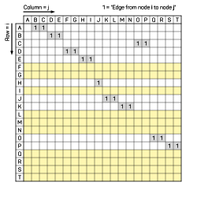
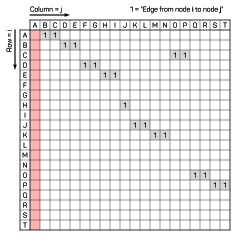
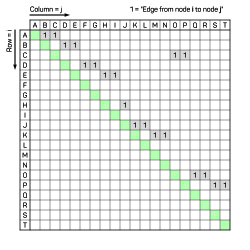
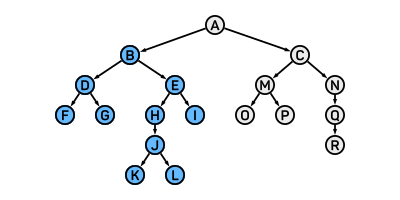
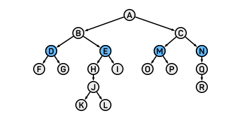

<style>
img[alt~="center"] {
  display: block;
  margin: 0 auto;
}
h1, h2, h3, h4, h5, h6, p, a, li {
  font-family: "Panton", sans-serif;
}
strong {
    font-weight: 600
}
</style>

# Tutorial 10 - 25.01./28.01.21 

Group 02/11 - Moritz Makowski - moritz.makowski@tum.de

<br/>

## Trees, BFS, DFS

---

## Today's Agenda

* Graphs
* (Binary) Trees
* **Exercise 11.1: Tree Attributes**
* Adjacency Matrix
* **Exercise 11.2: Adjacency Matrix**
* Tree Traversal
  * Depth-First-Search
  * Breadth-First-Search
* **Exercise 11.3/4: DFS/BFS on Paper**
* **Exercise 11.5/6: Implement DFS/BFS**

---

## Introduction

Up until now we have only used **linear data structures**. Elements inside these data structures (C-Array, Linked List, Stack, Queue, ...) are always ordered sequentially in one dimension.

<br/>

Today we will be convering another data structure which is not linear: **Trees**.

<br/>

Prime usecases:
* Efficient searching
* Storing hierarchical data

---

Trees are a special form of directed graphs which are a special form of graphs.

---

## Undirected Graphs

A graph is a data structure that consists of **nodes/vertices (singular: vertex)** which are selectively connected by **edges**.

In an **undirected graph** these edges do not have a particular direction. Vertices which are connected by an edge are also called **neighbors**.


---

## Directed Graphs

In a **directed graph** these edges **do** have a particular direction.


---

## Tree (Computer Science)

*https://en.wikipedia.org/wiki/Tree_(data_structure).*

<br/>

A tree is a **special form of a directed graph**, which is:
* **Asymmetric**: There are no two-way-edges and no self-edges (A->A)
* **Acyclic**: There are no loops - there is **no more than one path*** between any two vertices
* **Connected**: There is **at least one path*** between any two vertices

<br/>

**when ignoring edge-direction*

---

## Tree

In general a tree can have as many branches as you want.
&nbsp;
&nbsp;


---

## Binary Tree

A **binary tree** is tree, where each vertex is limited to **two outgoing branches**.
&nbsp;
&nbsp;


---

## Binary Tree

**Root** = A vertex with no incoming edges
**Leaf** = A vertex with no outgoing edges
&nbsp;


---

## Binary Tree

**Parent** = The vertex from which a vertex has an incoming edge
**Child/Children** = The vertex/vertices to which a vertex has an outgoing edge
**Siblings** = Two vertices with the same parent


---

## Binary Tree

**Ancestor** = All vertices on the path from a given vertex to the tree root
**Descendants** = All vertices on any path from a given vertex to any leaf (included)
&nbsp;


---

## Binary Tree

**Subtree** = A tree formed by a vertex and all its descendants
&nbsp;
&nbsp;


---

## Binary Tree

**Depth of a Vertex** = The length of the path from a vertex to the tree root
**Height of a Tree** = The length of the longest path from the root to any leaf
&nbsp;


---

## Binary Tree

**Balanced Tree** = A tree for which the length of the shortest path and the length of the longest path differ by no more than one
&nbsp;


---

## **Exercise 11.1: Tree Attributes**


Answer the following questions for the tree on the right:

**(a)** Root
**(b)** Leaves
**(c)** Parent of **E**
**(d)** Children of **E**
**(e)** Subtree of **E**
**(f)** Descendants of **E**
**(g)** Ancestors of **E**
**(h)** Tree height
**(i)** Depth of **E**
**(j)** Siblings of **E**
**(k)** Is the tree balanced?

---

## Adjacency Matrix

You can store any graph (directed or undirected) - and therefore also trees - in a 2D-matrix called an **adjacency matrix**.

<br/>

Row index = `i`
Column index = `j`

A `1` in Cell `i`,`j` represents an edge from node `i` to node `j`.

<br/>

All the other entries are `0` and can be left empty when writing the matrix down.

---

## Adjacency Matrix - Example


---

## **Exercise 11.2: Adjacency Matrix**

<br/>
<br/>
<br/>
<br/>
<br/>
<br/>
<br/>
<br/>
<br/>

Draw the related adjacency matrix.


---

**Solution:**

<br/>
<br/>
<br/>
<br/>
<br/>
<br/>
<br/>
<br/>
<br/>
<br/>


---

All rows belonging to **leaves** are empty.



---

All columns belonging to **roots** are empty.



---

The diagonal is also empty because a tree (in CS) does not have **self-edges**.



---

## Tree Traversal

**Traversing a Tree** = Going through a tree by visiting every vertex and possibly executing some function on this vertex

Example: Printing out the value of each vertex.

<br/>

Two approaches:
* **Depth-first** search/traversal (DFS)
* **Breadth-first** search/traversal (BFS)

---

## Depth-First Search/Traversal (DFS)

With DFS you explore downwards of a child first before exploring its siblings.

<br/>

This definition is recursive: In order to traverse a tree, you have to traverse both of its childrens subtrees independently. If again these children have subtrees as well you "go deeper" and explore these deeper subtrees first before visiting the other siblings.

---

## DFS - "Going Deep"

Let's say you want to traverse a full tree with the root **A**.
&nbsp;


---

## DFS - "Going Deep"

Therefore you have to traverse the subtree's of **A**: Starting with **B**'s subtree.
&nbsp;



---

## DFS - "Going Deep"

Therefore you have to traverse the subtree's of **B**: Starting with **D**'s subtree.
&nbsp;


---

## DFS - "Going Deep"

Therefore you have to traverse the subtree's of **D**: Starting with **F**'s subtree.
&nbsp;


---

## DFS - "Going Deep"

Once you have fully traversed a subtree you go back to the previous node with a not-fully-traversed subtree. Next subtree: **G**.


---

## DFS - "Going Deep"

Once you have fully traversed a subtree you go back to the previous node with a not-fully-traversed subtree. Next subtree: **E**.


---

## DFS - "Going Deep"

Now you have to go deep again and traverse the subtree's of **E**: Starting with **H**'s subtree.


---

... and so on ...

---

## Traversal Orders

To traverse a tree we perform the following actions:
* Visiting the current node
* Traversing the left subtree
* Traversing the right subtree

<br/>

The order in which we perform these action is called the **traversal order**. There are three possible traversal orders:
* **Preorder** traversal
* **In-order** traversal
* **Postorder** traversal

---

## Preorder Traversal

1. Current Vertex
2. Left Subtree
3. Right Subtree


<br/>

```c
Print Result: _ _ _ _ _
```

---

## Preorder Traversal

1. Current Vertex
2. Left Subtree
3. Right Subtree


<br/>

```c
Print Result: A B C D E
```

---

## In-Order Traversal

1. Left Subtree
2. Current Vertex
3. Right Subtree


```c
Print Result: _ _ _ _ _
```

---

## In-Order Traversal

1. Left Subtree
2. Current Vertex
3. Right Subtree


<br/>

```c
Print Result: C B D A E
```

---

## Postorder Traversal

1. Left Subtree
2. Right Subtree
3. Current Vertex


<br/>

```c
Print Result: _ _ _ _ _
```

---

## Postorder Traversal

1. Left Subtree
2. Right Subtree
3. Current Vertex


<br/>

```c
Print Result: C D B E A
```

---

## **Exercise 11.3: Depth-First-Search on Paper**

Given the following tree:


**(a)** Do a preorder depth-first traversal on paper

**(b)** Do a in-order depth-first traversal on paper

**(c)** Do a postorder depth-first traversal on paper

<br/>

*For every node with only one child, this child is the left child.*

<br/>
<br/>
<br/>

---

**Solution:**

```c
Preorder: A   B D E   C F H I K L J G

In-Order: D B E   A   K I L H J F C G

Postoder: D E B   K L I J H F G C   A
```

---

## Breadth-First Search/Traversal (BFS)

BFS is the opposite of DFS - obviously.

We first explore all child vertices of a given vertex and then go "to the next level" and explore vertices on this level.

<br/>

Example:
1. Printing out the names of your mothers parents
2. Printing out the names of your mother and her brothers/sisters
3. Printing out your name and the names of all of your cousins (only from your mothers family)

---

## BFS - "Level by Level"

Start at the root **A**.


---

## BFS - "Level by Level"

Then visit all vertices with depth 1.


---

## BFS - "Level by Level"

Then visit all vertices with depth 2.



---

## BFS - "Level by Level"

Then visit all vertices with depth 3.


---

## BFS - "Level by Level"

Then visit all vertices with depth 4.


---

## BFS - "Level by Level"

Then visit all vertices with depth 5.


---

## BFS - Example


<br/>

```c
Print Result: _ _ _ _ _
```

---

## BFS - Example


<br/>

```c
Print Result: A B E C D
```

---

## **Exercise 11.4: Breadth-First-Search on Paper**

Given the following tree:


Do a breadth-first traversal on paper

<br/>
<br/>
<br/>
<br/>
<br/>
<br/>
<br/>

---

**Solution:**

```c
BFS: A   B C   D E F G   H   I J   K L
```

---

## **Exercise 11.5/11.6: Implement DFS/BFS**

The given **char-tree** is realized with a struct for each node:

```c
struct TreeNode {
  char value;
  struct TreeNode *left;
  struct TreeNode *right;
}
```


You are given a `struct TreeNode *root`, which is a pointer to the root node.

Each node contains its `value` (a single character) as well as two pointers to its left and right child node. If one of these pointers is a NULL-pointer (pointer value is `0`), it means that the respective subtree does not exist.

---


<br/>

All the logic to initialize and construct a **tree is already implemented**. If you are curious you can have a look at `tree.c`.

Inside the file `main.c` you can ignore this tree-initialization.

---

## **Exercise 11.5: Implement Depth-First-Traversal**

**Task:** Implement DFS inside `boilerplate/dfs.c`, where each nodes value is printed out followed by a whitespace. 

<br/>

*I strongly encourage you to use recursion!*

---

## **Exercise 11.6: Implement Breadth-First-Traversal**

**Task:** Implement BFS inside `boilerplate/bfs.c`, where each nodes value is printed out followed by a whitespace. 

<br/>

*Disclaimer: Implementing BFS is not as easy as DFS!*

*With recursion you can think about passing the both the node and a "depth left to go" to a function.*

---

Compile your code with:
```bash
gcc -Wall -Werror -std=c99 boilerplate/main.c tree/tree.c
```

<br/>

Compile the solution with:
```bash
gcc -Wall -Werror -std=c99 solution/main.c tree/tree.c
```

---

## **Additional Practice (optional)**

You can think about functions for our tree that might be useful. Examples are: A function that returns the ...

* ... height of a given (sub-)tree
* ... depth of a given vertex with a given root
* ... total number of nodes in a given subtree
* ... average value of all nodes in a given subtree
* ... number of times a given value occurs in a given subtree

<br/>

*I have not implemented any solutions for these examples, but you can send me some if you're proud with yours ;)*

*This following is just a proposal if you want to have a little bit more coding practice!*

---

## See You Next Week!

All **code examples** and **exercise solutions** on **GitLab** (solutions right after my tutorial):
https://gitlab.lrz.de/dostuffthatmatters/IN8011-WS20

<!-- Generated with https://www.qrcode-monkey.com/de -->


---


