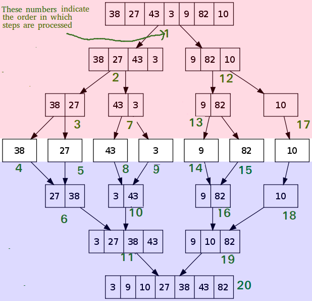
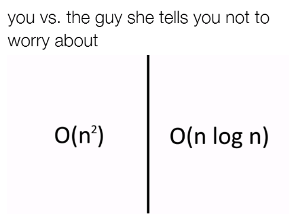

<style>
img[alt~="center"] {
  display: block;
  margin: 0 auto;
}
</style>

# Tutorial 11 - 01.02./04.02.21 

Group 02/11 - Moritz Makowski - moritz.makowski@tum.de

<br/>

## Sorting Algorithms

---

## Today's Agenda

* Bubble Sort
* **Exercise 12.1/2: Bubble Sort**
* Merge Sort
* **Exercise 12.3/4: Merge Sort**
* Comparing Algorithms: Big-O
* Application Example: Element Lookup
* **Exercise 12.5 (optional): Implement Binary Search**

---

## Interesting Sources:

https://www.geeksforgeeks.org/sorting-algorithms/

<br/>

***Important**: Most of the code-examples used (e.g. sorting steps) are **not valid C-code!***

---

## General

**Input:** An array of elements which appear in a random order.

**Output:** The same array but with all of its element in an ascending/descending order regarding some logic.

<br/>

The input and output data structures do not have to be C arrays. Good Options:
* Singly-/Doubly-Linked List: Very easy to move elements around
* (Binary) Tree: Common for searching

<br/>

*However, in this tutorial we will only use sequentially stored arrays.*

---

## Bubble Sort

This is probably the **simplest sorting algorithm** to implement. However, it is also **one of the least performant** ones.

<br/>

**Basic procedure:**
1. Interate through all successive pairs of elements (`1`/`2`, `2`/`3`, `3`/`4`, ...)
2. For every pair: Determine if the order has to be changed - if so, swap the elements
3. When the end of the array has been reached and at least one pair has been swapped, jump to step 1
4. If no pair has been swapped through the whole iteration, the array is sorted 

---

## Bubble Sort - Example

```c
[5, 1, 4, 2, 8];  // input
```

---

**Iteration 1:**
```c
[5, 1, 4, 2, 8];  // Looking at 5/1
[1, 5, 4, 2, 8];

[1, 5, 4, 2, 8];  // Looking at 5/4
[1, 4, 5, 2, 8];

[1, 4, 5, 2, 8];  // Looking at 5/2
[1, 4, 2, 5, 8];

[1, 4, 2, 5, 8];  // Looking at 5/8
[1, 4, 2, 5, 8];
```

---

**Iteration 2:**
```c
[1, 4, 2, 5, 8];  // Looking at 1/4
[1, 4, 2, 5, 8];

[1, 4, 2, 5, 8]; // Looking at 4/2
[1, 2, 4, 5, 8];

[1, 2, 4, 5, 8];  // Looking at 4/5
[1, 2, 4, 5, 8];

[1, 2, 4, 5, 8];  // Looking at 5/8
[1, 2, 4, 5, 8];
```

---

**Iteration 3:**
```c
[1, 2, 4, 5, 8];  // Looking at 1/4
[1, 2, 4, 5, 8];

[1, 2, 4, 5, 8];  // Looking at 4/2
[1, 2, 4, 5, 8];

[1, 2, 4, 5, 8];  // Looking at 4/5
[1, 2, 4, 5, 8];

[1, 2, 4, 5, 8];  // Looking at 5/8
[1, 2, 4, 5, 8];
```

Not a single swap in this iteration: **The array is sorted**.

---

Bubble Sort in action:

https://www.youtube.com/watch?v=nmhjrI-aW5o

---

## **Exercise 12.1: Bubble Sort on Paper**

```c
[G, L, A, C, I, E, R, S];  // input
```

<br/>

**(a)** Sort the array on paper.

**(b)** How many full array-passes took place?

**(c)** How many comparison operations took place?

---

## **Exercise 12.2: Implement Bubble Sort**

Implement a bubble sort algorithm in C.

I do supply a template `exercise_12_02_bubble_sort_boilerplate.c` **but** you are free to use whichever program structure you prefer.

---

## Merge Sort

Algorithms like Merge Sort are also called **divide-and-conquer algorithms**. The basic idea behind those approaches is: Break the problem up into smaller problems and solve them independently.

<br/>

Prerequisites:
* A list of length `0` or `1` is already sorted
* The process of combining two already-sorted lists into one sorted list is called **"merging"**

---

## Merging Two Sorted Lists

The new list is empty at the beginning.

<br/>

Repeat until both old lists are empty
1. Look at the first elements of each list.
2. Append* the smaller element to the newly created list
3. Remove that element from its list (converting this lists second element into the first one)

<br/>

**append =  add at the end*

---

## Merging - Example

Two already-sorted lists:
```c
[3, 27, 38, 43], [9, 10, 82]
```

New list:
```c
[]
```

---

**Step 1:** `3 < 9` so append `3` to the new list.

<br/>

Old list's:
```c
[27, 38, 43], [9, 10, 82]
```

New list:
```c
[3]
```

---

**Step 2:** `27 > 9` so append `9` to the new list.

<br/>

Old list's:
```c
[27, 38, 43], [10, 82]
```

New list:
```c
[3, 9]
```

---

**Step 3:** `27 > 10` so append `10` to the new list.

<br/>

Old list's:
```c
[27, 38, 43], [82]
```

New list:
```c
[3, 9, 10]
```

---

**Step 4:** `27 < 82` so append `27` to the new list.

<br/>

Old list's:
```c
[38, 43], [82]
```

New list:
```c
[3, 9, 10, 27]
```

---

**Step 5:** `38 < 82` so append `38` to the new list.

<br/>

Old list's:
```c
[43], [82]
```

New list:
```c
[3, 9, 10, 27, 38]
```

---

**Step 6:** `43 < 82` so append `43` to the new list.

<br/>

Old list's:
```c
[], [82]
```

New list:
```c
[3, 9, 10, 27, 38, 43]
```

---

**Step 7:** `list_1` is empty so append `list_2` to the new list.

<br/>

Old list's:
```c
[], []
```

New list:
```c
[3, 9, 10, 27, 38, 43, 82]
```

---

## Merge Sort - Process

If a list has two or more elements split it in half:
1. Merge-Sort each list separately
2. Merge the two sorted lists into one big list

<br/>

As you might recall, a list with less than 2 elements is already sorted so "Merge-Sorting" a list with `1` or `0` elements will just return the same list.

<br/>

This is a prime example of a **recursive definition**.

---

<style>
img[alt~="center"] {
  display: block;
  margin: 0 auto;
}

h6 {
  display: block;
  margin: 0 auto;
  padding: 0;
}
h6:nth-of-type(1) {
  color: hsl(0, 80%, 35%);
}

h6:nth-of-type(2) {
  color: hsl(200, 80%, 30%);
}
</style>



###### 1. Splitting
###### 2. Merging

---

Merge Sort in action:

https://www.youtube.com/watch?v=JSceec-wEyw

---

## **Exercise 12.3: Merge Sort on Paper**

```c
[G, L, A, C, I, E, R, S];  // input
```

<br/>

**(a)** Sort the array on paper.

**(b)** How many split-operations and how many merge-operations (two lists -> one list) took place?

**(c)** How many comparison operations took place?

---

## **Exercise 12.4: Implement Merge Sort**

Implement a merge sort algorithm in C.

I do supply a template `exercise_12_04_merge_sort_boilerplate.c` **but** you are free to use whichever program structure you prefer.

---

## Comparing Algorithms

We need some way to **measure how our algorithm performs** with an increasing number of input arguments (here: Length of the array to be sorted).

<br/>

**Question:** Any ideas on how we might do that?

---

## Comparing Algorithms - Two Ways

1. Measuring how much time the algorithm takes - rather inelegent way

2. Counting the number of operations the algorithm takes to complete - e.g. how many comparisons do we have to make.

*No claim of completeness.*

<br/>

However we need some way to quantify that.

---

## Big-O

With the **Big-O-Notation** we are given a way to describe this **"scalability-performance" of an algorithm**. This is called **complexity-analysis**.

Every algorithm that is executed on input data of variable length `n` has a Big-O-Complexity.

---

## Big-O - Bubble Sort

**Worst and Average Case Time Complexity**: $O(n^2)$.

**Best Case Time Complexity**: $O(n)$. 

<br/>

*Worst case occurs when array is reverse sorted.*

*Best case occurs when array is already sorted.*

<br/>

This means that on average, when **doubling the input length**, the **execution time is quadrupled**.

---

## Big-O - Merge Sort

**Worst, Average and Best Case Time Complexity**: $O(n \cdot \log{(n)})$.

<br/>

This means that in most cases when **doubling the input length**, the **execution time is** only a bit more than **doubled**.

---

## Different Types of Complexities

**Time Complexity** = How much time does it take to execute the algorithm?

**Space Complexity** = How much memory space does the algorithm need during execution?

---

If you want to cover this Big-O notation a bit more, you can check out a video (~20 min) of one of my favorite JS-Developers on YouTube:

https://youtu.be/kS_gr2_-ws8?t=73

<br/>

---

The CS-lecture at TUM where this will be covered best is:
**IN0007 Grundlagen: Algorithmen und Datenstrukturen**

https://campus.tum.de/tumonline/WBMODHB.wbShowMHBReadOnly?pKnotenNr=452818&pOrgNr=14189

<br/>

*You can take this course in your 5th/6th semester in **Wahlbereich 2**.*

---

## Application Example: Element Search

**Task:** Check if a specific number occurs in a given list of integers.

**Brute-Force Search** = Iterating through the whole list and check every single element.

---


## "Brute-Force" Approaches

In general a **Brute-Force Approach** is an solution-finding approach where you don't use any logically determined guesses but just try any possible combination.

<br/>

For example if you were to guess an **alpha-numeric password of length 8**.
* Brute-Forcing: Try out every combination from `00000000` to `ZZZZZZZZ`.
* Better Approach: Try to make educated guesses - names of pets/relatives in combination with numbers, etc.

---

If the **list were to be already sorted**:

What better approach than brute-force can we use for our search?

---

## Element Search - Binary Search

Looking for element `x` in a given list with length `n`.

Element in the middle = Element at index `n/2` (rounded up or down)

<br/>

Iterative process:

1. If the **element in the middle is equal to `x`** return `true`

2. If the **element in the middle is greater than `x`** run the **binary search on the left half** of the array (excluding the element in the middle)

3. If the **element in the middle is smaller than `x`** run the **binary search on the right half** of the array (excluding the element in the middle)

---

Looking for the integer `7`:


---

https://www.youtube.com/watch?v=9FzT2I21F3k

---

## **Exercise 12.5 (optional): Implement Binary Search**

Implement a binary search on a standard already-sorted C-array.

I do supply a template `exercise_12_05_binary_search_boilerplate.c` **but** you are free to use whichever program structure you prefer.

---

## See You Next Week!

All **code examples** and **exercise solutions** on **GitLab** (solutions right after my tutorial):
https://gitlab.lrz.de/dostuffthatmatters/IN8011-WS20

<!-- Generated with https://www.qrcode-monkey.com/de -->


---



