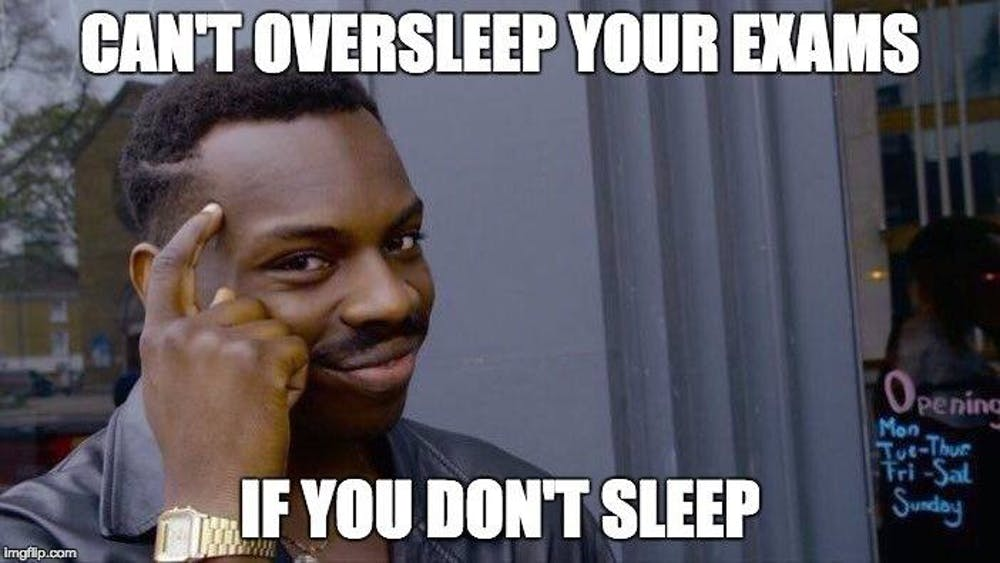

# Tutorial 12 - 08.02./11.02.21 

Group 02/11 - Moritz Makowski - moritz.makowski@tum.de

 

## Revision

---

## Some topics not covered in the tutorial

* Lecture 06 (from slide 11): Syntax Trees
* Lecture 06 (from slide 17): **Control Flow Diagrams**
* Lecture 08 (from slide 25): **Reading C declarations**
* Lecture 08 (from slide 37): Custom type definitions with `typedef`
* Lecture 09 (from slide 41): The preprocessor
* Lecture 10 (from slide 11): **Bitwise operators**
* Lecture 10 (from slide 26): Operator precedence

 

The **bold** topics are really relevant for the exam.

---

*Today's slides will only include the list of keywords, which we will talk about.*

---

## Today's Agenda - 1/2

1. Variables
2. Loops
3. Conditionals
4. Arrays
5. Functions
6. Structs, Enums, Unions

---

## Today's Agenda - 2/2

7. Pointers
8. Dynamic Memory Allocation
9. Lists, Stacks, Queues
10. Trees
11. Sorting
12. Further Topics

---

## 1. Variables

* Types of variables
* What is scope?
* What is type casting?

---

## 2. Loops

* What types of loops are there?
* When should you use which type?

---

## 3. Conditionals

* Two common ways of conditionally executing code?
* Syntax of the two ways

---

## 4. Arrays

* What are arrays?
* How to access/manipulate an array
* Multidimensional arrays

---

## 5. Functions

* Why should we use functions? (As many reasons as you can think of)
* What happens when we pass parameters to a function?
* Function syntax passing arrays to functions

---

## 6. Structs, Enums, Unions

* Why should you use structs?
* Struct syntax

 

* Why should you use Enums?
* Enum syntax

 

* Why should you use Unions?
* Union syntax

---

## 7. Pointers

* What are pointers?
* What is referencing and dereferencing?
* Syntax of referencing and dereferencing

 

* Arrays and pointers?
* "Passing by reference" vs. "Passing by value"

---

## 8. Dynamic Memory Allocation

* Use cases, where we need dynamic memory allocation
* Basic steps when dynamically allocating memory
* The two allocation-functions and the difference between them
* Syntax of the two functions

---

## 9. Lists, Stacks, Queues

* What types of lists are there?
* Benefits and drawbacks of each type?
* *(Bonus)* How may you combine the two types we mainly talked about?

 

* How does a stack work?
* Find an example in the real world and use case in computer science

 

* How does a queue work?
* Find an example in the real world and use case in computer science

---

## 10. Trees

* Difference between a regular tree and a binary tree
* Prime usecase for binary trees?
* Name the different parts of a tree

 

* How to implement a tree in C?
* What is binary search?

 

* Usecase: Syntax Trees

---

## 11. Sorting

* How does bubble sort work?
* How does merge sort work?

 

* Which of the above is more efficient?
* Types of efficiency 
* How can we describe efficiency?

---

## 12. Further Topics

* Why should we use CFG's?
* How to draw a CFG from code
* How to generate code from a CFG

 

* Interpret a C declaration

 

* How do bitwise operators work?
* Why should we use them in some cases?

 

**CFG = Control Flow Graph*

---

## Good Luck for the Exam!

All **code examples** and **exercise solutions** on **GitLab**:
https://gitlab.lrz.de/dostuffthatmatters/IN8011-WS20

<!-- Generated with https://www.qrcode-monkey.com/de -->

---

